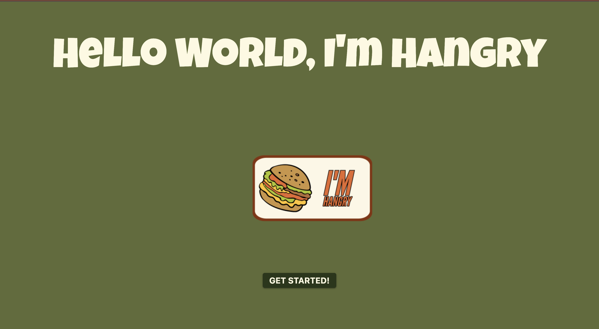
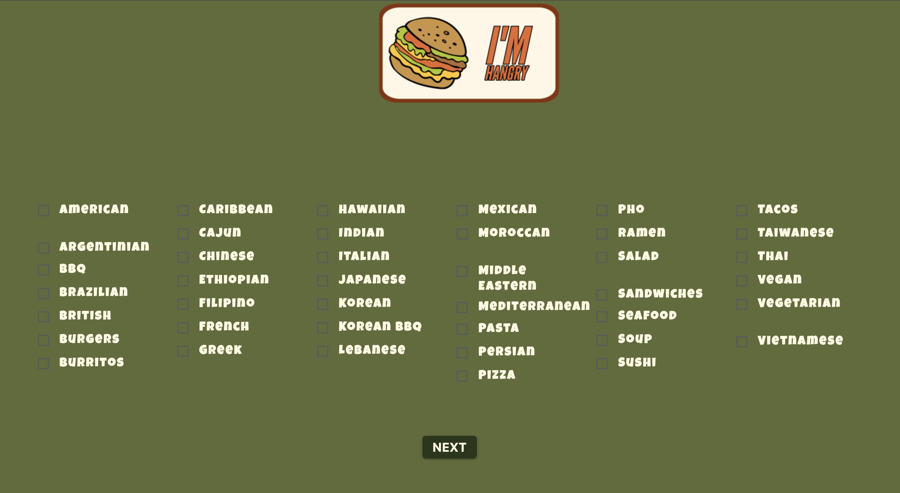
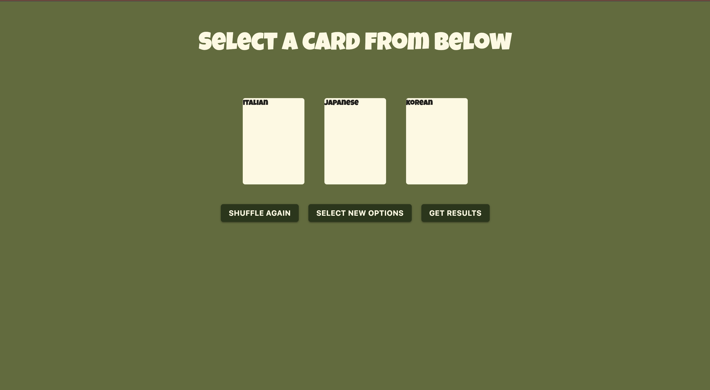
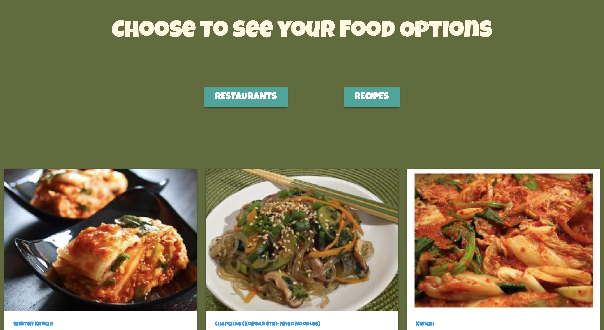

# I'm Hangry

## Description:

Deciding on what to eat when one is hungry can sometimes prove to be a tedious task.  To help undecided hungry eaters pick something to eat out of a list of food choices. This webpage solves the problem of not being able to deide on what to eat when one is hungry by letting the user choose from a list of cuisines which are put into a shuffled deck of cards to select from. Through this project we learned the implementaion of third party APIs. From finding which one works to how to intigrate it to our project and have it make the correct calls was the main focus of this project. The shuffled cards that were made to help randomly select the cuisine to eat was a feature that we challenged ourselves with becasue it was something we did not learn a lot about in class. 

## Languages Used:
- CSS
- JavaScript
- HTML
- JQuery
- Materialize

## Usage:
- add images of website

Deployed Link: https://miacarmen.github.io/im-hangry/

## Credits:
Maitreya (Mia) Carmen
Christian Tellez
Sid Quinsaat
Amnider Kaur

## License:
Copyright (c) 2022 akaur09,tellez215, sharkby7e,TheDevilsDisco

Permission is hereby granted, free of charge, to any person obtaining a copy
of this software and associated documentation files (the "Software"), to deal
in the Software without restriction, including without limitation the rights
to use, copy, modify, merge, publish, distribute, sublicense, and/or sell
copies of the Software, and to permit persons to whom the Software is
furnished to do so, subject to the following conditions:

The above copyright notice and this permission notice shall be included in all
copies or substantial portions of the Software.

THE SOFTWARE IS PROVIDED "AS IS", WITHOUT WARRANTY OF ANY KIND, EXPRESS OR
IMPLIED, INCLUDING BUT NOT LIMITED TO THE WARRANTIES OF MERCHANTABILITY,
FITNESS FOR A PARTICULAR PURPOSE AND NONINFRINGEMENT. IN NO EVENT SHALL THE
AUTHORS OR COPYRIGHT HOLDERS BE LIABLE FOR ANY CLAIM, DAMAGES OR OTHER
LIABILITY, WHETHER IN AN ACTION OF CONTRACT, TORT OR OTHERWISE, ARISING FROM,
OUT OF OR IN CONNECTION WITH THE SOFTWARE OR THE USE OR OTHER DEALINGS IN THE
SOFTWARE.